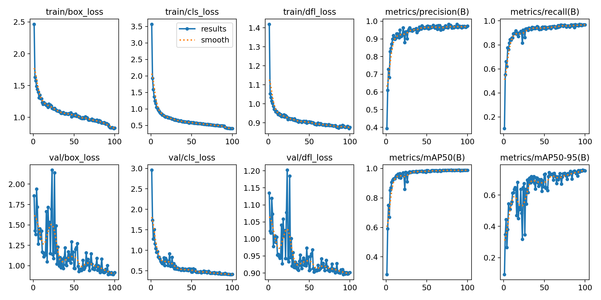
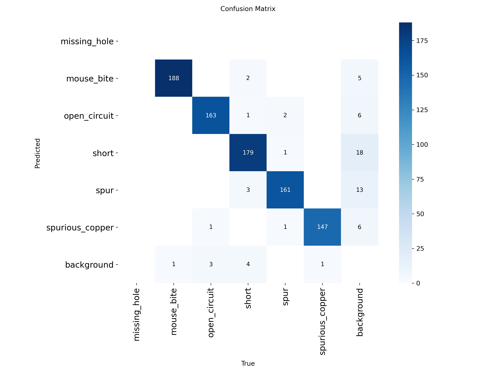

## 개요

이 프로젝트는 PCB(Printed Circuit Board) 결함을 자동으로 탐지하는 **YOLO기반 Anomaly Detection 시스템**입니다. 기존 COCO 사전학습 모델로는 PCB 회로판을 `traffic light`, `kite`등 엉뚱하게 탐지하였는데 `data.yaml`파일에 존재하는 6개의 결함 클래스에 대한 이미지와 라벨들을 제공함으로써 PCB 결함 클래스만을 대상으로 **fine-tuning**을 수행하였습니다.

- 목적: 회로판 이미지 영역속 결함 예측
- 사용한 결함 클래스(6종): `missing_hole`, `mouse_bite`, `open_circuit`, `short`, `spur`, `spurious_copper`
- 데이터셋 출처: [PCB Defect Detection Dataset](https://www.kaggle.com/datasets/liuxiaolong1/pcb-defect-detection-dataset) by LIU XIAO LONG1

## 기타 개선 사항

1. YOLO 학습 시 결과 저장 경로를 프로젝트 전용 경로로 변경하여 관리함.

YOLO 학습 결과는 기본적으로 C:\Users\jinhyeongsik\runs\detect 경로에 저장됩니다.
본 프로젝트에서는 관리 편의를 위해 D:/project/anomaly detection/detect 로 이동하여 사용했습니다.

## 📈 모델 성능 분석 (Performance Analysis)

모델의 훈련 및 검증 결과를 시각화하여 탐지 성능을 분석했습니다.

| 항목 | 설명 |
|------|------|
| **Loss Curve** | 훈련 과정에서 손실이 안정적으로 감소하며 수렴함. |
| **Precision-Recall Curve** | mAP@0.5 = **0.977**, 클래스별 평균 0.98 이상의 높은 정밀도 |
| **Confusion Matrix** | 클래스 간 혼동이 적고, `spur` ↔ `short` 외엔 명확하게 분리됨 |
| **BoxPR Curve** | Bounding Box 탐지 성능도 안정적이며, recall이 높을수록 precision 유지됨 |

   
  <em>모델 학습 및 손실 곡선</em>

   
  <em>Precision-Recall Curve</em>

   
  <em>Confusion Matrix</em>

